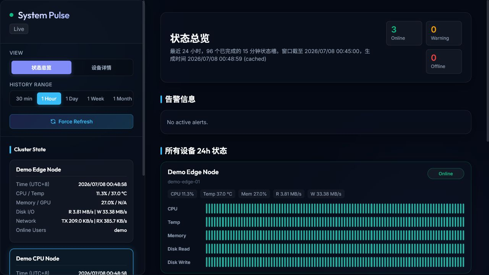

# DPS Hardware Monitor / 服务器性能监视系统

A lightweight hardware monitoring stack for Linux and Windows nodes. It collects
CPU, GPU, memory, disk, network and user-process metrics into JSONL files, then
serves a Flask dashboard with cluster overview, per-node charts, disk topology,
and optional alerting.

一个轻量级服务器性能监视系统：采集 Linux/Windows 节点的 CPU、GPU、内存、磁盘、
网络和用户进程指标，写入 JSONL 文件，并通过 Flask 前端展示集群总览、单机曲线、
磁盘拓扑和可选告警。



## Features / 功能

- Headless JSONL metrics writer for Linux and Windows.
- SSH-based dashboard collector with optional jump-host support.
- Local demo mode with anonymized sample metrics.
- 24-hour status overview using 96 stable 15-minute buckets.
- Per-device charts for CPU, memory, GPU, temperature, disk I/O and network I/O.
- Disk usage topology view.
- Optional email alert loop configured only through environment variables.
- Forwarder for internal nodes that cannot be read directly by the dashboard.

- 无界面 JSONL 采集器，支持 Linux 和 Windows。
- Dashboard 通过 SSH 读取远端指标，支持跳板机。
- 自带脱敏 demo 数据，可直接本地预览。
- 状态总览使用 96 个 15 分钟固定时间桶展示 24 小时状态。
- 单设备 CPU、内存、GPU、温度、磁盘 I/O、网络 I/O 曲线。
- 磁盘容量拓扑视图。
- 邮件告警完全通过环境变量配置。
- 内网子节点可通过 forwarder 转发到汇聚节点。

## Repository Layout / 目录结构

```text
monitor.py                       # Interactive terminal monitor
daemon_writer.py                 # Headless JSONL writer
forwarder/daemon_forwarder.py     # Child-node forwarder
windows_dashboard/               # Flask dashboard frontend/backend
windows_dashboard/devices.example.yaml
examples/generate_demo_metrics.py # Anonymized demo metrics generator
scripts/*.example                 # Deployment templates
```

## Quick Demo / 快速预览

```powershell
cd dps-hardware-monitor
python -m venv .venv
.\.venv\Scripts\Activate.ps1
pip install -r windows_dashboard\requirements.txt
python examples\generate_demo_metrics.py
copy windows_dashboard\devices.example.yaml windows_dashboard\devices.yaml
$env:DASHBOARD_ENABLE_ALERTER = "0"
python windows_dashboard\app.py
```

Open:

```text
http://127.0.0.1:8080
```

Linux/macOS:

```bash
cd dps-hardware-monitor
python3 -m venv .venv
. .venv/bin/activate
pip install -r windows_dashboard/requirements.txt
python examples/generate_demo_metrics.py
cp windows_dashboard/devices.example.yaml windows_dashboard/devices.yaml
DASHBOARD_ENABLE_ALERTER=0 python windows_dashboard/app.py
```

## Collect Metrics / 采集指标

Run a one-shot snapshot:

```bash
python monitor.py --once
```

Write metrics continuously:

```bash
python daemon_writer.py --interval 10 --jsonl logs/metrics.jsonl
```

Windows local writer:

```powershell
.\windows_dashboard\run_local_monitor.ps1
```

## Configure Devices / 配置设备

Copy the example config:

```bash
cp windows_dashboard/devices.example.yaml windows_dashboard/devices.yaml
```

For local files:

```yaml
devices:
  - id: local-node
    name: Local Node
    local: true
    remote_file: examples/demo-cpu-01.metrics.jsonl
```

For SSH:

```yaml
devices:
  - id: remote-linux-01
    name: Remote Linux Node
    host: <HOST_OR_IP>
    user: <SSH_USER>
    port: 22
    key_file: <ABSOLUTE_PATH_TO_PRIVATE_KEY>
    remote_file: /opt/dps-hardware-monitor/logs/metrics.jsonl
```

For a jump host:

```yaml
devices:
  - id: internal-node-01
    name: Internal Node
    host: <INTERNAL_HOST_OR_IP>
    user: <SSH_USER>
    port: 22
    key_file: <ABSOLUTE_PATH_TO_PRIVATE_KEY>
    remote_file: /opt/dps-hardware-monitor/logs/metrics.jsonl
    jump_host: <JUMP_HOST_OR_IP>
    jump_user: <JUMP_SSH_USER>
    jump_port: 22
    jump_key_file: <ABSOLUTE_PATH_TO_JUMP_PRIVATE_KEY>
```

Do not commit `windows_dashboard/devices.yaml`; it may contain private hosts,
usernames and key paths.

不要提交 `windows_dashboard/devices.yaml`，其中可能包含真实主机、用户名和密钥路径。

## Optional Alerts / 可选告警

Alerts are disabled in the demo. Enable and configure them with environment
variables only:

```bash
export DASHBOARD_ENABLE_ALERTER=1
export ALERT_EMAIL=ops@example.com
export SMTP_HOST=smtp.example.com
export SMTP_PORT=465
export SMTP_USER=ops@example.com
export SMTP_PASS=change-me
```

## Deployment / 部署

`scripts/hwmon-dashboard.service.example` is a generic systemd template. Copy it
to your server, replace paths and environment variables, then install it as a
system service.

`scripts/hwmon-dashboard.service.example` 是通用 systemd 模板。部署时请复制后替换路径
和环境变量，再安装为系统服务。

## Security Notes / 安全说明

This public version intentionally excludes production logs, raw metrics, private
device inventory, SSH keys, real infrastructure addresses and operational notes.

公开版本刻意排除了生产日志、原始监控数据、真实设备清单、SSH 密钥、真实基础设施地址
和运维记录。

Before publishing your own fork, scan it with:

```bash
rg -n -uu -S "BEGIN .*PRIVATE KEY|password|passwd|token|secret|api[_-]?key|Bearer|Authorization"
rg -n -uu -S "((25[0-5]|2[0-4][0-9]|1?[0-9]{1,2})\.){3}(25[0-5]|2[0-4][0-9]|1?[0-9]{1,2})"
rg -n -uu -S "[A-Za-z0-9._%+-]+@[A-Za-z0-9.-]+\.[A-Za-z]{2,}"
```

## License / 许可证

MIT
